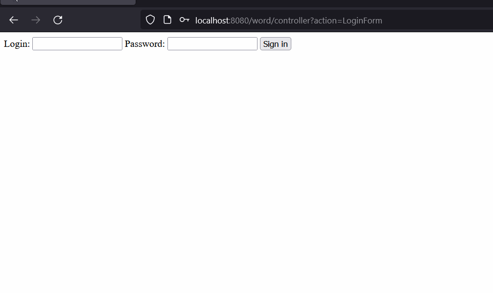
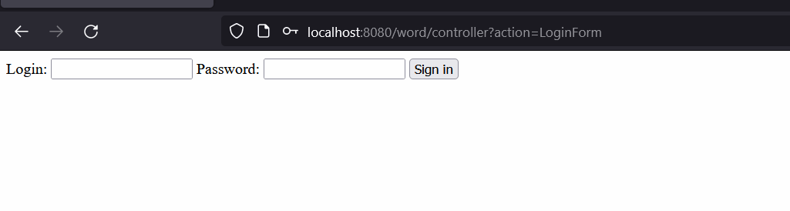
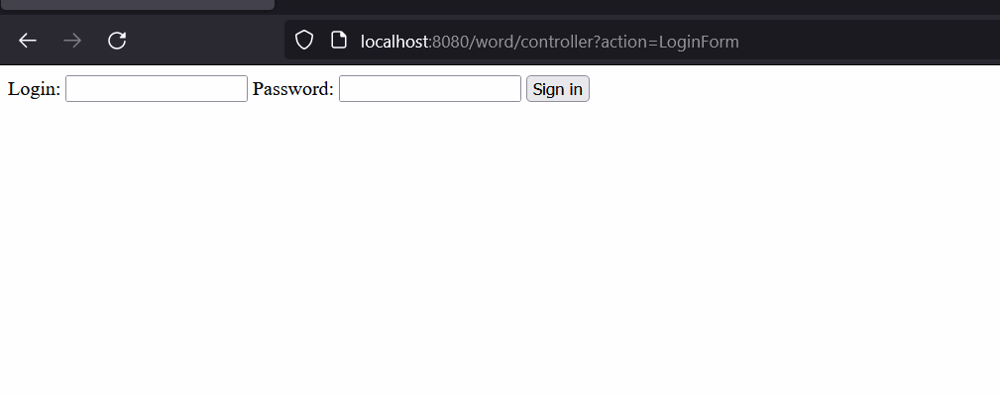

# New Word: Seu dicionário pessoal

## Descrição
Um sistema web que permite que um aluno adicione dúvidas sobre palavras, e que um professor possa suprir essas dúvidas.
Este é um projeto desenvolvido para exercitar os conceitos aprendidos nos cursos de Java Servlet e Servlet MVC da Alura.
O sistema foi desenvolvido em Java, utilizando arquitetura MVC, Servlets e JSP. 
Ao utilizar essas ferramentas, pude me desafiar a entender o controle de fluxo de dados através de Filters, Servlet(Controller), Actions e JSPs.

## Funcionalidades
- CRUD das palavras
- Login e Logout com HttpSession

  

- Autenticação e Autorização com Filter
- Perfis de Aluno e Professor

  

- Correção de palavras pelo professor

  

## O que pode melhorar?
Este foi um projeto bem simples, mas que me ajudou a entender o fluxo de dados em aplicação web com servlets.
Porém, ainda há várias coisas que podem ser melhoradas: 
- Algoritmo e Estrutura de Dados, este são tópicos que preciso me aprofundar mais, pois através deles meu código poderia ser otimizado; 
- Camada de persistência, neste projeto foi utilizado somente uma classe que simula a persistência de um Banco de Dados, pretendo desenvolver novos projetos que integrem um Banco de Dados e utilizar padrões de projeto como o Connection Factory;
- Front-end. Não desenvolvi quase nada do Front-end nesta aplicação, mantive o foco no Back-end, mas este é um ponto que preciso me aventurar um pouco.
